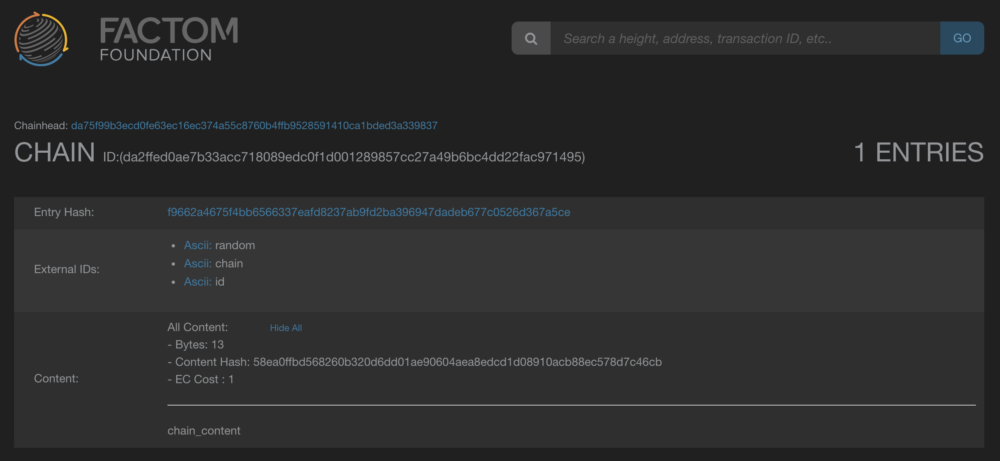

# factom-api

This library provides Python clients for interacting with the factomd and factom-walletd APIs. While not all API methods have been implemented yet, you'll find most of what you need to build a working application are available, along with shortcut methods for accomplishing common tasks involving multiple calls between the wallet and daemon.

Because Python 2 is reaching EOL, this API client (from version 1.0.0 onwards) targets Python 3.5 and higher.

If you're unfamiliar with Factom, I encourage you to [read the documentation](http://docs.factom.com/), especially the [white paper](https://github.com/FactomProject/FactomDocs/blob/master/whitepaper.md). In a nutshell, Factom provides a layer on top of the Bitcoin blockchain making it possible to secure data faster and in larger amounts than the Bitcoin network would allow alone.

## Getting started

### Installing the API client

The easiest way to install is directly from pip:

```
$ pip install factom-api
```

## Usage

I'll go over a few common operations here you'll most likely use in applications. In general you'll need instances of both the wallet and factomd clients to build and submit transactions. To build new clients:

```python
from factom import Factomd, FactomWalletd

# Default settings
factomd = Factomd()
walletd = FactomWalletd()

# You can also specify default fct and ec addresses, change host, or specify RPC credentials, for example:
fct_address = 'FA2jK2HcLnRdS94dEcU27rF3meoJfpUcZPSinpb7AwQvPRY6RL1Q'
ec_address = 'EC2jhmCtabeTXGtuLi3AaPzvwSuqksdVsjfxXMXV5gPmipXc4GjC'

factomd = Factomd(
    host='http://someotherhost:8088',
    fct_address=fct_address,
    ec_address=ec_address,
    username='rpc_username',
    password='rpc_password'
)
```

### Transacting factoids to factoids

First let's query the balance in both of our fct addresses:

```python
>>> fct_address1 = 'FA2jK2HcLnRdS94dEcU27rF3meoJfpUcZPSinpb7AwQvPRY6RL1Q'
>>> fct_address2 = 'FA3TMQHrCrmLa4F9t442U3Ab3R9sM1gThYMDoygPEVtxrbHtFRtg'
>>> ec_address = 'EC2jhmCtabeTXGtuLi3AaPzvwSuqksdVsjfxXMXV5gPmipXc4GjC'

# Initialize the two clients
>>> factomd = Factomd()
>>> walletd = FactomWalletd()

# Query the balance in our first address. There should be a large amount
>>> factomd.factoid_balance(fct_address1)
{'balance': 1999999735950}

# The second address should be empty.
>>> factomd.factoid_balance(fct_address2)
{'balance': 0}
```

The wallet client provides a shorcut method `fct_to_fct()` which performs all the API calls needed to submit a simple fct to fct transaction. This includes adding inputs and outputs, calculating the fee, building the signed transaction, and submitting it to the network.

```python
>>> walletd.fct_to_fct(factomd, 50000, fct_to=fct_address2, fct_from=fct_address1)
{'message': 'Successfully submitted the transaction', 'txid': 'a4d641f13d82b1d1682549d44fa41c7e1b01f1a16f8cbddb5c695df53fcebfd7'}
```

The server reports the transaction was submitted and if we wait a few seconds we can see the results:

```python
>>> factomd.factoid_balance(fct_address2)
{'balance': 50000}
```

### Converting factoids to entry credits

Our new entry credit address should have a balance of zero:

```python
>>> factomd.entry_credit_balance(ec_address)
{'balance': 0}
```

First, we need to ask for the conversion rate:

```python
>>> factomd.entry_credit_rate()
{'rate': 1000}
```

This tells us we'll need to burn 1000 factoids in exchange for 1 entry credit, so let's purchase 50 entry credits for 50000 factoids. Similar to `fct_to_fct()`, the wallet client also provides a `fct_to_ec()` shortcut for building and submitting simple fct conversion transactions.

```python
>>> walletd.fct_to_ec(factomd, 50000, fct_address=fct_address1, ec_address=ec_address)
{'message': 'Successfully submitted the transaction', 'txid': 'd70b14ce05a21dbf772d1894383694b4537e17454915fc42dc20f02c1e0e2df2'}
```

And if we query our entry credit balance we see the conversion has happened:

```python
>>> factomd.entry_credit_balance(ec_address)
{'balance': 50}
```

### Writing chains and entries

The real meat and potatoes is the ability to easily read from and write data to the blockchain. Let's write some test data. The wallet client provides a `new_chain()` shortcut method that handles the API calls and encoding needed for creating a new chain. You could also build the transaction manually if you'd like more control over each step, but for most cases this is going to be easier.

```python
>>> walletd.new_chain(factomd, ['random', 'chain', 'id'], 'chain_content', ec_address=ec_address)
{'message': 'Entry Reveal Success', 'entryhash': 'f9662a4675f4bb6566337eafd8237ab9fd2ba396947dadeb677c0526d367a5ce', 'chainid': 'da2ffed0ae7b33acc718089edc0f1d001289857cc27a49b6bc4dd22fac971495'}
```

If we wait a few minutes and search for the chain ID in the explorer we can see our initial entry:



Now let's add another entry to the same chain:

```python
>>> chain_id = 'da2ffed0ae7b33acc718089edc0f1d001289857cc27a49b6bc4dd22fac971495'
>>> walletd.new_entry(factomd, chain_id, ['random', 'entry', 'id'], 'entry_content', ec_address=ec_address)
{'message': 'Entry Reveal Success', 'entryhash': '96f0472c9ec8a76c861fb4df37beb742938f41bbe492dc04893337bf387b83c5', 'chainid': 'da2ffed0ae7b33acc718089edc0f1d001289857cc27a49b6bc4dd22fac971495'}
```

You should see the new entry appear shortly.

### Reading entries

If the entries in your chain reference each other, you may want to scan the entire chain in order to verify its integrity. The factomd client provides a `read_chain()` method which iterates over all entry-containing blocks and returns a list of entries in reverse order.

```python
>>> chain_id = 'da2ffed0ae7b33acc718089edc0f1d001289857cc27a49b6bc4dd22fac971495'
>>> factomd.read_chain(chain_id)
[{'chainid': 'da2ffed0ae7b33acc718089edc0f1d001289857cc27a49b6bc4dd22fac971495', 'extids': ['random', 'entry', 'id'], 'content': 'entry_content'}, {'chainid': 'da2ffed0ae7b33acc718089edc0f1d001289857cc27a49b6bc4dd22fac971495', 'extids': ['random', 'chain', 'id'], 'content': 'chain_content'}]
```

You can see the two entries we created earlier.

### Error handling

When things go badly, API methods will raise a `factom.exceptions.FactomAPIError` with details about the error.

```python
>>> walletd.new_chain(factomd, ['random', 'chain', 'id'], 'chain_content', ec_address=ec_address)
Traceback (most recent call last):
  File "<stdin>", line 1, in <module>
  File "/src/factom/client.py", line 196, in new_chain
    'ecpub': ec_address or self.ec_address
  File "/src/factom/client.py", line 56, in _request
    handle_error_response(resp)
  File "/src/factom/exceptions.py", line 18, in handle_error_response
    raise codes[code](message=message, code=code, data=data, response=resp)
factom.exceptions.InvalidParams: -32602: Invalid params
```

More data about the error is attached to the exception instance:

```python
>>> try:
...     walletd.new_chain(factomd, ['random', 'chain', 'id'], 'chain_content', ec_address=ec_address)
... except FactomAPIError as e:
...     print(e.data)
... 
Chain da2ffed0ae7b33acc718089edc0f1d001289857cc27a49b6bc4dd22fac971495 already exists
```

If you'd like to catch more specific errors, there are exception subclasses for the different error codes returned by the APIs. See [factom/exceptions.py](factom/exceptions.py) for a list.


